# Examination of variables in order to Gather how Best to Predict Baseball Pitches

#### This repository was created by Ross Coleman, Saad Rehman, Lily Manetta, Maureen McCormack, and Maha Alaoui

#### Table of Contents
Introduction
Business Understanding
Data Understanding
Data Preperation
Modeling and Evaluation
Conclusion

# Introduction
This project aims to use the steps of the entire data science process to gain actionable insight. For this project, we are analyzing the statistics of MLB pitcher Clayton Kershaw. We aim to walk users through the following steps: Business Understanding, Data Understanding, Data Preparation, Modeling + Evaluating (EDA + Machine Learning Model Training), and Deployment. This project aims to use the insights to help Clayton Kershaw be the best possible pitcher that he can be by exploiting the data.

# Business Understanding
In the United States, baseball is a very popular and competitive sport. In the MLB, an estimated 1,026 players compete. Outside of the MLB, making it to the MLB is a very competitive process. It is estimated that 10.5% of players advance to that level. In addition to the Major League (which is broadcasted all the time on ESPN and is what most people talk about), there are levels at which other players trying to make it to the MLB compete in. This league is referred to the Minor League. Ironically, a Lafayette alumni, JP Woodward, competes at this level. Post graduation from Lafayette, he signed with the Minor League Version of the Philadelphia Phillies. This next section of the business understanding will describe the differences between the two leagues as it is relevant for our analysis in that it validates the data we have and allows us to make sense of it from the standpoint of professional players.

In the Major League, there are two leagues- the American and the National. Each league has 15 teams and three divisions. Each team has what is known as a farm system which is where players and/or teams from the minor league are advanced up to the major league. Throughout the season, MLB teams will play not only the teams in their league but will also rotate and play teams outside of it. In terms of roster size, each team in the MLB carries 25 people, which is important as it shows the spots on these teams are extremely valuable and sought after. Ironically, just today, the MLB locked out its players. This is the first time this has happened in 26 years. A lockout occurs when the teams owners lock out its players. These issues typically stem from pay and items relating to the off-season as players are not paid. During lockouts, players are only paid through their signing bonuses and they do not receive their base salaries. This is relevant for our analysis as it shows how important it for Kershaw to use our actionable insight to be the best player he can be to receive a higher signing bonus.
  
   As baseball is measured on an inviduals performance, understanding those statistics is not only important to find ways to increase your performance but is also crucial as it shows players ways to not get cut. Already, baseball is a very difficult sport due to the nature of the sport; requiring players to catch/hit a small little ball, on an even smaller bat, is a hard task to accomplish. The sport requires incredible hand-eye coordination which to an extent, cannot be taught. Finding ways to increase ones natural talent is a difficult task so it is important to find ways to increase the non-natural talent of a player. 

  At the center of this project are the statistics of Clayton Kershaw. Kershaw has played 13 seasons with the Los Angeles Dodgers and he is a left-handed starting pitcher. Recently, Kershaw is a free agent which means that he is looking for another team to sign him. This role came with him finding out that the Dodgers were not offering him a Qualifying Offer. Talks of him being signed with the Boston Red Sox are in the works however no offers and signings are on the table. This signing for Kershaw is crucial in that it could be his last big-time contract as he is aging out and has earned more than enough income to survive. Spotrac estimated Kershaw earned a whopping $31 million dollars this past season. Additionally, Kershaw has been injured numerous times, which makes understanding his specific statistics so important. 

  For this project, we are analyzing Kershaw's pitching statistics in 2013. We chose to analyze this year as it had the most observations and was a year where Kershaw was not injured. For us, this makes analyzing his statistics easier as we can rule out other reasons for why he performed the way he did. Additionally in this year, Kershaw was a recipient of the Cy Young award, which was given to him for being the best pitcher in the National League. Understanding Kershaw's statistics are of great importance as it can help guide him to understand where he can be a better pitcher and help him to get a new contract with a highly-ranked team. 

  In addition to this project helping Kershaw to be the best pitcher he can be, our models can also help other pitchers understand what is most important about their pitch. We can help to answer the question of what aspects of a pitch most lead to a positive result for the pitcher. There are many different variables in our dataset that can help us with this, such as how fast the pitch is, how much spin is put on the pitch, and more. These results could change the way a pitcher trains, how much time he spends in the gym versus on the pitching mound, and what parts of his pitches he focuses on more.

  Baseball analytics is one of the fastest growing topics in the entire world. The use of analytics has revolutionized the baseball world to the point where now each baseball team has their own analytics department. This type of project is what each baseball team performs very often, all with the exact same goal: "What variables do we need to leverage in order to create the best baseball team we possibly can?
  
# Data Understanding
This data set contains pitch-by-pitch data for the MLB baseball player Clatyon Kershaw in the 2013 season. This data set contains 3,402 observations with 24 different variables. In this year, Clayton won the Cy Young award as the best pitcher in the National League. The variables within this dataset are measured using Major League Baseball's PITCHf/x system that uses camera systems in each ballpark to track characteristics of each pitch thrown.

The data was scraped from the MLB GameDay website (http://gd2.mlb.com/components/game/mlb/) using pitchRx

**BatterNumber:** Number of batters faced so far that game. The type of data for this variable is ratio. 

**Outcome:** One of 14 possible results for a pitch (e.g. Ball, Ball In Dirt, Called Strike, ..., Swinging Strike (Blocked). The data type for this variable is nominal.

**Class:** One of three classifications (B=ball, S=strike, or X=in play). The data type for this variable is nominal.

**Result:** From pitcher's perspective (Neg=ball or hit, Pos=strike or out).The data type for this variable is ordinal.

**Swing:** Did the batter swing at the pitch? (No or Yes). The data type for this variable is nominal. 

**Time:** Date and time of the pitch (format yyyy-mm-ddThh:mm:ssZ). The data type for this variable is interval. 

**StartSpeed:** Speed leaving the pitcher's hand (in mph). The data type of this variable is ratio. 

**EndSpeed:** Speed crossing home plate (in mph). The data type for this variable is ratio. 

**HDev:** Horizontal movement (inches). The data type for this variable is ratio. 

**VDev:** Vertical movement (inches). The data type for this variable is ratio. 

**HPos:** Horizontal position at home plate (inches from center, positive is catcher's right). The data type for this variable is ratio. 

**VPos:** Vertical position at home plate (inches above the ground).The data type for this variable is ratio. 

**PitchType:** Code for pitch type (CH=changeup, CU=curve, FF=fastball, or SL=slider). The data type for this variable is nominal. 

**Zone:** 1-9 in theoretical strike zone (upper left to lower right), 11-14 are out of strike zone. The data type for this variable is ordinal. 

**Nasty:** A measure on a 0-100 scale of difficulty of the pitch to hit (100 is most difficult).The data type for this variable is ratio. 

**Count:**Ball strike count (0-0, 0-1, 0-2, 1-1, 1-2, 2-1, 2-2, 3-1, or 3-2).The data type for this variable is ordinal. 

**BallCount:** Number of balls before the pitch (0, 1, 2, or 3). The data type for this variable is ratio. 

**StrikeCount:** Number of strikes before the pitch (0, 1, or 2). The data type for this variable is ratio. 

**Inning:** Inning of the game. The data type for this variable is ordinal. 

**InningSide:** Portion of the inning (bottom= pitcher at home or top=pitcher away). The data type for this variable is nominal. 

**Outs:** Number of outs when the pitch is thrown. The data type for this variable is ratio. 

**BatterHand:** Batter's stance (L=left or R=right). The data type for this variable is nominal. 

**ABEvent:** Result of the at bat (several possibilities). The data type for this variable is nominal. 

**Batter:** Name of the batter faced. The data type for this variable is nominal. 

**Source:** Data scraped from the MLB GameDay website (http://gd2.mlb.com/components/game/mlb/) using pitchRx

# Data Preperation
After the data is read into Google Colab, we can now drop the columns we are not using for this analysis. In this case, it is resultpred and resultpred1. These were predicted statistics for Kershaw by the source of the data that didn't make sense to us nor contribute to our project.

# Modeling and Evaluation
### Exploratory Data Analysis
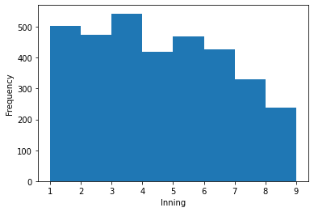
The histogram shows the inning of the game and the frequency of the pitches Kershaw threw. From this we can see that Kershaw threw the majority of his pitches between the third and fourth inning and his least pitches in the eighth and ninth. Additionally, from the fifth inning, we can see that his pitching decreases.
                                          
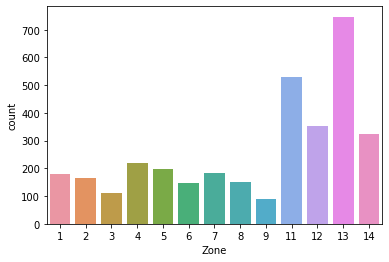
Zones 1-9 represents the strike zone and zones 11-14 are outside of the strike zone. The majority of his pitches are thrown outside of the strike zone, meaning the pitch is a ball. This is not good since 4 balls will lead to a walk and the batter will advance to first base.

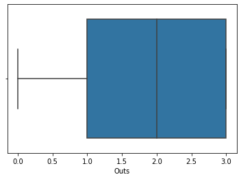
From the boxplot, we can see the five number distribution for the number of outs. It shows the min and the max for outs, with 0 being the min and 3 being the max.

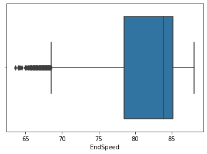
From this boxplot, we can see that the mean end speed for Kershaw’s pitches is between 83 and 85 mph. The min for this is 65 mph and the max is 90 mph. Again, these numbers are important for this project as they provide a baseline for understanding how fast Kershaw throws.

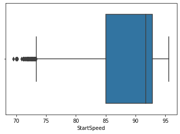
From this boxplot, we can see that the mean start speed for Clayton Kershaw is between 93 and 95 mph. The min for this is 70 and the max is 100.

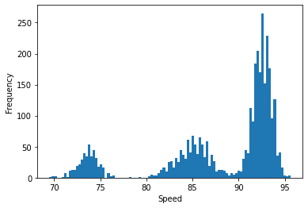
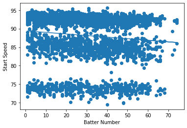
Using our references, we found that baseball had an average of 146 pitches per game. This graph illustrates as the batter numbers increase, the end speed gets slower. This is a relevant finding as it shows that Kershaw gets tired over time so his pitches get slower.

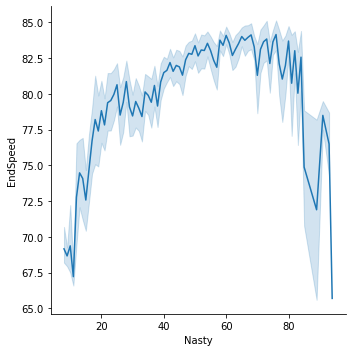
In the line plot, we can see that his fastest pitches are not necessarily the ones with the most spin.

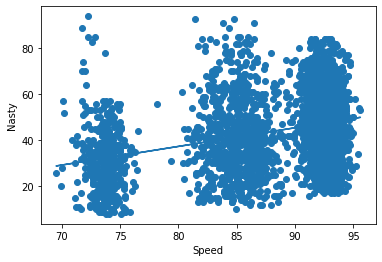
In the scatterplot, we can see that as the speed gets faster, the nasty score increases, but not by much. This is a weak correlation as it signifying that the fastest speeds are not necessarily the most difficult pitches.

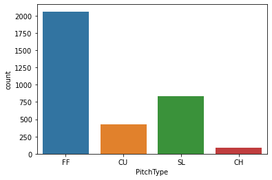
The most common pitch is fastball with over 2,000, followed by slider, then curveball and least common is changeup.

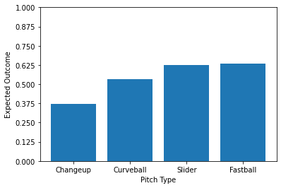
In the bar chart above, we see that pitching sliders and fastballs are more likely to result in a positive outcome, while pitching a changeup is the least likely to result in a positive outcome.

# Machine Learning
In this section, we are using machine learning to predict the outcome of the pitch Kershaw threw. We are using machine learning to predict if the outcome of the pitch is a strike or foul.

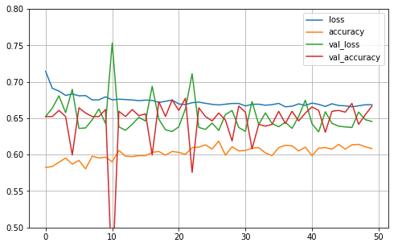

# Deployment and Conclusion
In this project, we used Clayton Kershaw’s 2013 Pitching Statistics to gain insight on ways he could increase his pitching speeds and outcomes. Through this project as well as our prior research, we can conclude that Kershaw is one of the best pitchers in the MLB. For example, from the boxplots that we created, we can see that Kershaw’s average start and end speeds were 85 to 93 mph. Compared to other players in the league who typically throw between 75-85 mph, these statistics are very high. This finding is relevant to our business understanding and findings as it we showed in our machine learning portion that pitches speed has a significant effect on the result of the pitch. According to The Complete Pitcher, Kershaw could increase his speed by increasing his pelvic and arm strength. So, focusing on Kershaw's pitch speed could help him to be the best pitcher possible.

Much of our exploratory data analysis gives background information regarding Kershaw's pitches. We can understand Kershaw's pitches and himself as a pitcher. For example, our histogram of the starting pitch speeds shows that there are three main buckets of speeds, which are dependent on the type of pitch he throws. Fastballs are going to take up the bucket with the highest mph, followed by changeups, followed by curveballs and sliders. We also have a count plot that shows how frequently Kershaw throws each type of pitch. A final example of how we used the EDA to further understand the data was by creating a scatterplot of Kershaw's pitch speeds as being dependent on how many batters he had faced in that game so far. There was a negative relationship between the two, which makes sense because as a game continues Kershaw will get more tired, so his speed will decrease.

In our machine learning models, we chose three variables that we believed significantly contributed to a successful result. Speed, nastiness and batter number were the two variables that we chose, because we figured that the more speed and more spin a pitch has, the harder it will be for the batter, so the better for Kershaw.

We first ran a logistic regression model, as the y variable, "Result" is a binary variable. When fitting our model in the logistic regression we obtained an accuracy that was somewhat accurate but could be improved. Therefore we also ran a neural network to attempt to gain more accurate results. Unfortunately, the accuracy didn't increase by much. This suggests that we should include more variables that have higher explanatory power to increase our accuracy and generate a better predictor as to how well Kershaw's pitches will be. In baseball analytics nowadays, there are always more available data that we can incorporate into our models to gain a higher accuracy score.

The application of these findings to our business understanding and insight is that it shows that Clayton Kershaw could use these statistics and results to solidify and improve his pitching game. If he utilizes this, he could use his pitching strength and talent as leverage for signing his next contract and with his new team. He could also extend his baseball career to be longer than the average baseball player. This project also showed that there are numerous ways in which he can either improve or extend his success; whether that is throwing pitches every day or going to the gym, there are ways to do it. The limitation with this study is that these statistics are from 2013, which was 7 years ago. Since then, Kershaw has increased his pitches and has become even better than before. Some directions of future research for this study include analyzing other factors that could influence pitches, including body weight, height, location of the game, and nutrition.

# Link to Video Explanation
https://www.youtube.com/watch?v=xVDP32wl_yE&feature=youtu.be
# Link to Presentation
https://youtu.be/hdorrP-Kt0s

# Link to Google Colab
https://colab.research.google.com/drive/15Wgk6IUgyj564Akj5AQTF24Fb2LLIu6y?usp=sharing

# References
http://www.thecompletepitcher.com/pitching_velocity.htm

https://bleacherreport.com/articles/671695-aroldis-chapman-and-the-15-fastest-pitches-ever-recorded

https://www.milb.com/news/gcs-173407668

https://www.dummies.com/article/home-auto-hobbies/sports-recreation/baseball/what-you-need-to-know-to-follow-major-league-baseball-156840

https://www.popsci.com/story/science/why-is-hitting-a-baseball-so-hard/

https://www.espn.com/mlb/story/_/id/32754352/everything-need-know-mlb-looming-lockout
